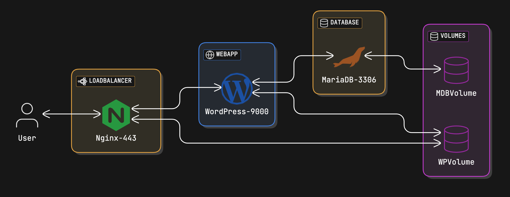

1_ How to setup Virtual Machine for Inception project

inceptionVm-guide
This is a guide to install the virtual machine for Inception project for 42 School
first of all start by adding the virtual machine to your virtualbox by clicking new

next write the name of the vm and don't select the iso as it will do thing automatically for this version of virtualbox. after this step just go with default settings and click create

when you start the virtual machine you will be asked to select the iso file to install the vm. select the iso file and click start you can install the debian iso from the debian website here

go for the manual installer and select the default settings and click continue

until you reach the user creation step. here you can create a user with the name of your choice and a password. you can put your intra log in as the username. after this step you can click continue and the installation will start.

choose guided - use entire disk and click enter

go for all files in one partition and click continue

just click continue and the installation will start

click yes and the installation will start

when it ask for the media installation click continue and then you will get this option click yes

and then select no

select what suits you and click enter

continue with the default settings and click continue

default enter

the only things you would need are ssh server and standard system utilities. click continue

now install the GRUB boot loader

select the disk you want to install the GRUB boot loader on and click continue

which is in our case /dev/sda

now your vm is installed and you can start it and login with the user you created

write the username and password

switch to root user with the following command:

su -

update and upgrade the system and then install sudo with the following command:

apt-get update && apt-get upgrade && apt-get install sudo -y

add your user to the sudo group with the following command:

adduser username sudo
or

 usermod -aG sudo username

now you can edit the sudoers file with the following command:

sudo visudo

just edit the line below the root line adding yuor username and the privileges you want to give it. in our case we will give it all privileges

for the ssh you can edit the /etc/ssh/sshd_config file and change the port to 4242

find the line with Port 22 and change it to Port 4242

change it to 4242

restart the ssh service with the following command:

sudo service ssh restart

now if you want to display it in vs code you can install the remote ssh extension

click the little icon on the bottom left

click on connect current window to host if you want the same window

choose + Add New SSH Host...

write your username and localhost followed by the port ex:

aalseri@localhost -p 4242

click continue

go for the first config file

you can see that it's successfully connected when you see the pop up on the bottom right corner of the screen

write the password of the user and you will be connected to the vm

once the SSH:localhost appear on the bottom left corner of the screen you can just navigate to the folder you want to work on same as you do with your own computer

installation you need to make before going forward:

sudo apt-get install git wget zsh vim make openbox xinit kitty firefox-esr filezilla -y
Docker Engine Installation

sudo apt-get update && sudo apt-get upgrade -y
first we will set the repository

sudo apt-get update
sudo apt-get install ca-certificates curl gnupg -y
sudo install -m 0755 -d /etc/apt/keyrings
curl -fsSL https://download.docker.com/linux/debian/gpg | sudo gpg --dearmor -o /etc/apt/keyrings/docker.gpg
sudo chmod a+r /etc/apt/keyrings/docker.gpg
echo \
  "deb [arch="$(dpkg --print-architecture)" signed-by=/etc/apt/keyrings/docker.gpg] https://download.docker.com/linux/debian \
  "$(. /etc/os-release && echo "$VERSION_CODENAME")" stable" | \
  sudo tee /etc/apt/sources.list.d/docker.list > /dev/null
installing the docker engine:

sudo apt-get update
sudo apt-get install docker-ce docker-ce-cli containerd.io docker-buildx-plugin docker-compose-plugin
at the end to run docker from your user you need to add it to the docker group:

sudo gpasswd -a $USER docker

newgrp docker
to be able to access the websites or filezilla you just need to execute:

startx

you can click on web browser and you will be able to access the website

to be able to access your website via username.42.fr you need to edit the /etc/hosts file and add the following line:

vim /etc/hosts

add new line under your host name

127.0.0.1 username.42.fr

NOTE: Keep in mind this is a guide to help coders do the project efficiently and faster by providing the minimum things they would need to complete it and not install many useless things such as gui which would make the virtual machine slow and crash at some point.

2_ How to connect Remote_SSH from VScode to Debian VM

in vscode --> extension -->search for remote ssh (from microsoft)
SSH --> connect to 127.0.0.1, add user password

3_ How to learn step by step each web service and docker

user <--> nginx444 (loadbalancer) <---> wordpress-900 (Webapp- Content management system)  <-----> Mariadb-3306(Database) <-----> MDBvolume(Volumes) + WPVolume(Volumes)

4_ How to finalize the project and other notes

List of commands:

sudo apt-get update && apt-get upgrade
sudo apt install sudo -y

// add honguyen as sudo
adduser honguyen sudo
sudo visudo
--> edit: honguyen ALL=(ALL) ALL

nano /etc/hosts

127.0.0.1 honguyen.42.fr
127.0.0.1 localhost

// add user
sudo adduser honguyen
sudo usermod -aG sudo honguyen
sudo addgroup docker
sudo usermod -aG docker honguyen
sudo addgroup vboxsf honguyen
sudo usermod -aG vboxsf honguyen

// install SSH, ufw, and change port

sudo nano /etc/ssh/sshd_config
port 22 --> port 4242
sudo service ssh restart
go the settings --> network --> NAT advanced --> change port 4242, ip: 127.0.0.1

connect ssh from ternmial

ssh honguyen@localhost -p 4242

// install necessary apt

sudo apt-get install git wget zsh vim make openbox xinit kitty firefox-esr filezilla -y

// install
sudo apt-get update && sudo apt-get upgrade -y
sudo apt-get update
sudo apt-get install ca-certificates curl gnupg -y
sudo install -m 0755 -d /etc/apt/keyrings

curl -fsSL https://download.docker.com/linux/debian/gpg | sudo gpg --dearmor -o /etc/apt/keyrings/docker.gpg
sudo chmod a+r /etc/apt/keyrings/docker.gpg

echo \
  "deb [arch="$(dpkg --print-architecture)" signed-by=/etc/apt/keyrings/docker.gpg] https://download.docker.com/linux/debian \
  "$(. /etc/os-release && echo "$VERSION_CODENAME")" stable" | \
  sudo tee /etc/apt/sources.list.d/docker.list > /dev/null

// install docker engine
sudo apt-get update
sudo apt-get install docker-ce docker-ce-cli containerd.io docker-buildx-plugin docker-compose-plugin

// add user to docker

sudo gpasswd -a $USER docker

newgrp docker

// other way to install docker and docker compose

$ apt install curl
$ sudo apt install docker.io
$ curl -O -J -L https://github.com/docker/compose/releases/download/v2.11.2/docker-compose-linux-x86_64
$ chmod +x docker-compose-linux-x86_64
$ sudo cp ./docker-compose-linux-x86_64 /usr/bin/docker-compose

//
startx

// change hosts

vim /etc/hosts
or
nano /etc/hosts

127.0.0.1 honguyen.42.fr
127.0.0.1 localhost

