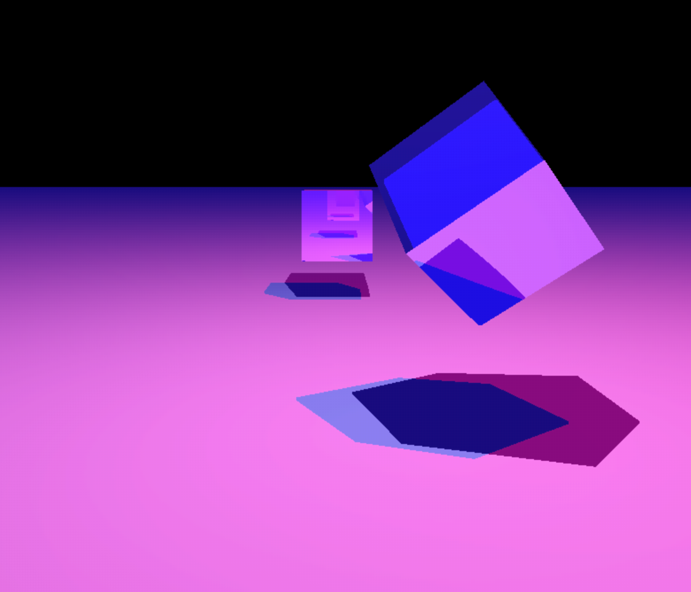

# 🌌 **miniRT** 🌌  
_A stunning real-time raytracer built from scratch!_

  
<small>*Simple vaporwave scene rendered using miniRT*</small>

---

## 🖼️ **Gallery**
<small>*Some of the cool stuff you can do in miniRT*</small>  
  


---

## 🌍 **Create Your World**
Write your own `.rt` scene files to populate your world with:
- Custom shapes, textures, and bump maps.
- Dynamic lighting and shadows.
- Ambient Global Colour

Example `.rt` file:
```plaintext
C 0,0,-10 0,1,0 90
sp 0,0,0 1.0 255,0,0
L 5,10,-5 1.0 255,255,255
A 0 0,0,0
```

---

## ✅ Prerequisites:
- Make
- X11, OpenGL (Linux)
- OpenGL, Appkit (MacOS)
- WSL (To run on Windows as a Linux container. Linux prerequisites apply).

---

## 🚀 **Getting Started**

1. Clone the repository:
   ```bash
   git clone https://github.com/Pastifier/miniRT.git
   cd miniRT
   ```

2. Build the project:
   ```bash
   make
   ```

3. Run the raytracer:
   ```bash
   ./miniRT <scene_name.rt>
   ```

   Replace `<scene_name.rt>` with the name of your `.rt` scene file. Explore pre-made scenes or create your own for limitless creativity!

---

## ✨ **Features**

### 🖼️ **Ray Tracing**
- Handles intersections with multiple shapes:
  - **Spheres**, **planes**, **cylinders**, **cones**, and **cubes**.
- Full support for:
  - Ambient, diffuse, and specular lighting.
  - Reflections/Refractions
  - Shadows and customizable **spotlights** with light falloff.

### 🎥 **Interactive Camera and Translatable-Objects**
- Camera Mode:
   - Real-time camera movement with smooth rotations and translations.
   - Camera-controls:
      - WASD: move around.
      - Space/Shift: Elevate/Descend (respectively).
      - Arrow-keys: Rotate
      - ESC in Camera-Mode exits the program.
- Select Mode:
   - Left-click objects to select them.
   - Object-controls:
      - R: toggle reflections/refractions.
      - WASD: move around.
      - Space/Shift: Elevate/Descend.
      - ESC in Select-Mode goes back to Camera-Mode.

### 🎨 **Textures and Bump Mapping**
- Bump mapping for intricate surface detail using normal maps on spheres and planes.
- Support for **XPM textures** to bring your scenes to life.

### 💡 **Spotlights**
- Customizable cone angles based on the spotlight's spot angle for realistic light falloff.

---

## 📈 **Performance Optimizations**
- **Multithreading**: Efficient thread distribution for high-speed rendering.
- **LERP'ing**:
   - Skip pixels and compare the colours of the surrounding pixels.
   - If the difference is below a certain threshold, interpolate the colours, otherwise, shoot the rays.
- **Our Very Own SIMD Linear Algebra Library**:
   - Optimized 4x4 matrix operations for raytracing.
   - Features the `lag_mat4s_get_transform_inverse()` function for lightning-fast decomposed matrix inversions.
   - _Innovative yet highly efficient mathematical design_.

### 🔍 **Benchmarks**
- **Simple scenes**: ~(12-36)ms per frame (~25-83 Frames Per Second).
- **Complex scenes with multiple normal map textures**: Under 200ms per frame (~5-10 Frames Per Second).

<small>*Benchmarked on typical scenes including multiple objects and light sources.*</small>

---

## 🔧 **Technical Details**
- **Rotations**:
  - Quaternion extraction for seamless orientation.
  - Axis rotation using **Rodrigues' formula**.
- **Deltatime** integration for fluid motion.
- **Custom Parsing**:
  - Read `.rt` scene files to define objects, lights, and camera configurations.
- **Thread Pool**:
  - Reuses threads for every frame to minimize initialization overhead.
- **Math Library: LagAMat**
  - Used efficient memory manipulations and mathematical tricks, made available by the use of unions.
  - Broke down matrices into scale and translation vectors, and rotational component, to cut the cost of calculating a general matrix inverse as it's not needed.

---

## 🎯 **What Makes our miniRT Unique?**
- Advanced yet approachable real-time rendering capabilities.
- A dedicated linear algebra library optimized for simplicity and performance.
- Innovative, efficient mathematical solutions built exclusively for this project.
- A perfect blend of creativity and technical rigor to make ray tracing interactive.

---

## 📜 **Acknowledgments**
- This project is part of the **42 School** curriculum, using the homebrewed MiniLibX Graphics Library to blend mathematical elegance and computational performance to bring scenes to life.  
- A huge thanks to our fellow 42-students for their support and encouragements, and especially
. Which was a huge inspiration, and showed us what this project is capable of!
- The Ray Tracer Challenge book for its simple, yet highly effective test-driven approach to raytracing.
- Our good friend Emad Aldeen Hammoude, for his cool suggestions on the README file!

--- 

## 🛠️ **How to Contribute**
1. Fork the repo.
2. Create a feature branch: ```git checkout -b my-feature```.
3. Commit your changes: ```git commit -m 'Add cool feature'```.
4. Push to the branch: ```git push origin my-feature```.
5. Open a Pull Request!

--- 

### 💻 Made with ❤️ for ray tracing enthusiasts everywhere.

